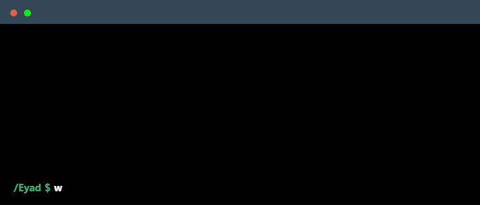

<!--
    Hey there, I'm Eyad Sharkawy!
    Happy to see you here exploring my README code.
    Feel free to take inspiration!
-->

 

<!--
    Your own Terminal GIF can be created here -> https://www.terminalgif.com
-->

    

<!--
     This is the list of my skills and the tools I use daily!
-->
### Main skills

### Studying

<!--
     A little bit about my background and projects
-->

### Background & Focus
I am a Front-End Developer specializing in modern, reactive web applications using **Angular** and **TypeScript**, alongside a strong foundation in modern **C++**. 

Currently studying at FCAI-CU, I focus heavily on the **Applied Software Solutions** track—building standard software applications seamlessly integrated with AI. I've also collaborated on award-winning tech competitions and developed tools like **Omni Sync**, **Photo Smith**, and **The Phoenix Project**.

<!--
     Fast links to my socials!
-->

### Connect with me!

    
    

<!--
     Oh, hello there, recruiters!
-->

### Employer?
> [!IMPORTANT]  
> <a href="https://drive.google.com/file/d/13BuLfFq4yK1U2Uj07gCUVFvV87zkjgR7/view?usp=sharing" target="_blank" download>Download my resume</a>

<!--
     Thanks for being my guest <3
-->
